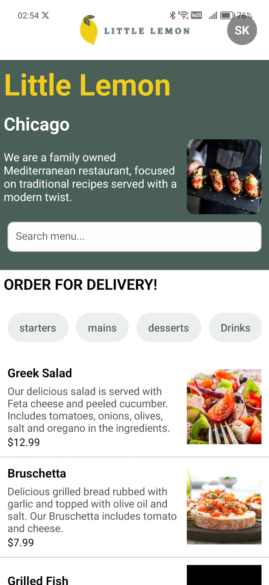
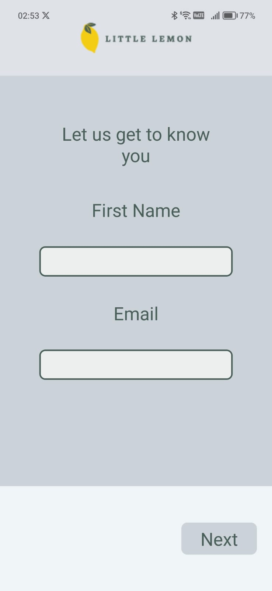
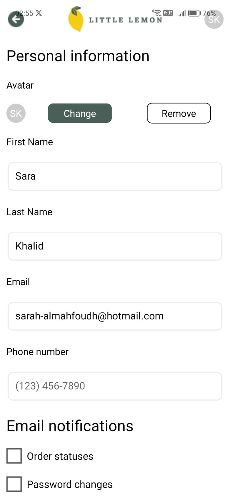
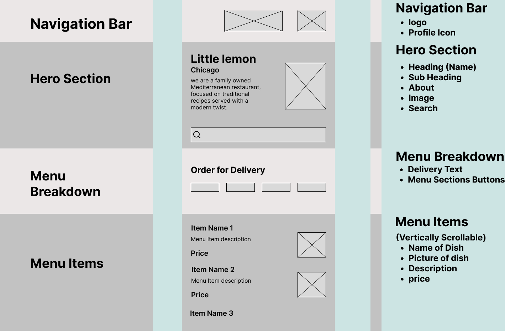

# 📱 React Native Capstone Project – Little Lemon App

This capstone project marks the culmination of the React Native specialization. The objective is to design and develop a real-world mobile application using React Native while demonstrating core concepts in UI/UX design, app structure, and network-based data handling.

---

## 🚀 Project Overview

This application simulates a mobile experience for **Little Lemon**, a fictional food delivery service. It includes user onboarding, profile management, home screen features, and dynamic data rendering, closely following modern UX/UI and software development practices.
   
---

## 📷 Wireframe

Below is the wireframe created during the design phase using Figma:

 

---

## 🧩 Features Implemented

### ✅ Module 1: Project Setup & Design
- Initialized project and connected to GitHub
- Created project folder and file structure
- Designed wireframes using Figma
- Styled components using React Native styling best practices
- Applied mobile UI/UX principles to design

### ✅ Module 2: Core Functionality
- Onboarding flow for first-time users
- Navigation between screens (React Navigation)
- Profile screen with editable user information
- Fetching remote data and storing locally
- Filterable and sortable data rendered on the Home screen

### ✅ Module 3: Project Assessment
- Completed self-review and peer review
- Uploaded all assets including wireframes and source code
- Prepared for final graded assessment

---

## 🛠️ Tech Stack

- **Framework:** React Native
- **Navigation:** React Navigation
- **Data Handling:** useState, useEffect, local storage
- **Design Tool:** Figma
- **Version Control:** Git & GitHub

---

## 🔍 Repository Structure
little-lemon/
├── assets/ # Contains images, fonts, wireframes, etc.
│ └── wireframe.png # Design wireframe from Figma
├── components/ # Reusable React Native components
├── navigation/ # Navigation setup (e.g., stack, tab navigators)
├── screens/ # App screens like Onboarding, Profile, Home
├── utils/ # Helper functions and constants
├── App.js # Entry point of the application
├── package.json # Project dependencies and scripts
└── README.md # Project documentation
